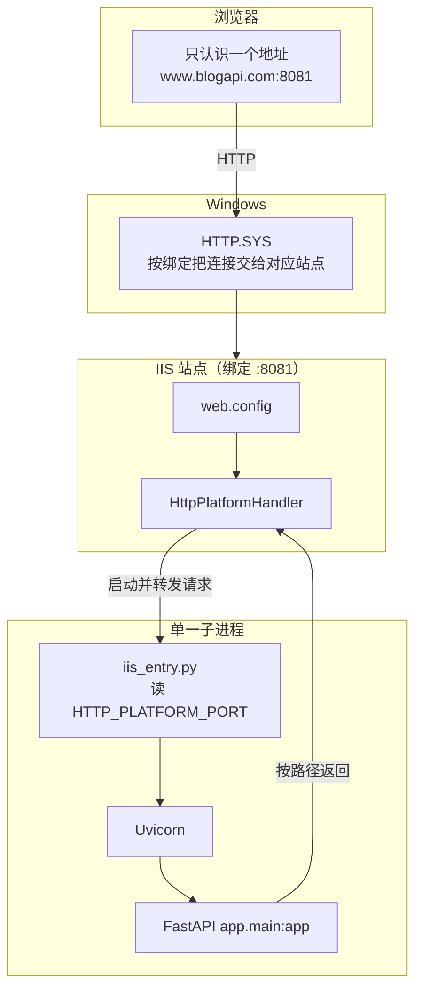
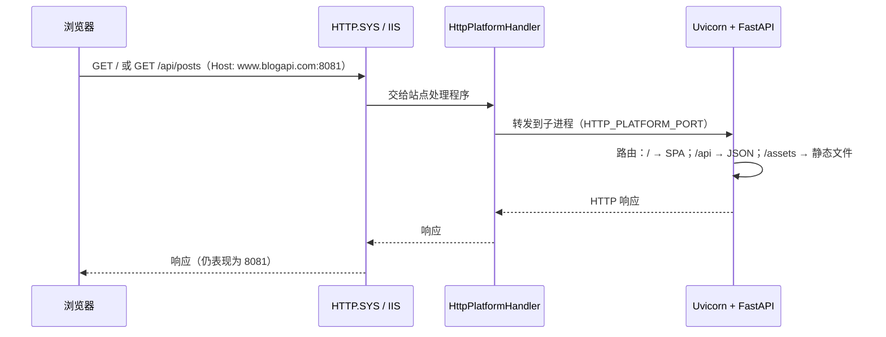
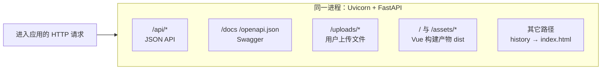

# IIS 如何实现「同一端口」同时提供前端与后端

本文说明在本项目（**PythonBlog**）中，浏览器只访问 **`http://www.blogapi.com:8081`** 一种地址时，为何既能打开 **Vue 页面**，又能调用 **`/api`**。涉及 **IIS、HttpPlatformHandler、Uvicorn、FastAPI** 的分工。

---

## 1. 先澄清：并不是「两个程序抢一个端口」

在 **TCP/HTTP** 层面，**同一台机器上同一端口只能被一个监听者占用**（通常如此）。常见误解是：

- 「IIS 占 8081 提供静态页，再开一个 Node/Python 也占 8081」—— **不可行**。

本项目的做法是：

| 层级 | 实际做什么 |
|------|------------|
| **IIS** | 在 **8081** 上接收 HTTP 请求，通过 **HttpPlatformHandler** 把请求**转交给一个子进程**。 |
| **子进程** | 只有一个：**Python** 运行 **Uvicorn**，加载 **FastAPI 应用**（`app.main:app`）。 |
| **FastAPI** | 在**同一个进程、同一个端口（由 IIS 注入的 `HTTP_PLATFORM_PORT`）**上，按 **URL 路径**区分：返回 HTML/JS/CSS、JSON API、上传文件、Swagger 等。 |

因此：**对外只有一个端口（8081）**；**对内也只有一个 Web 应用进程**在响应（由 IIS 反向连到该进程）。所谓「前后端同端口」，本质是 **一个后端进程里同时挂载了 API 与前端静态资源**，而不是 IIS 与另一个服务各监听 8081。

---

## 2. 结构图：如何实现「同一端口」

### 2.1 总体分层（谁在监听 8081）



说明：**8081 由 IIS 站点绑定占用**；**Python 进程**监听的是 **IIS 分配的本地端口**（环境变量 **`HTTP_PLATFORM_PORT`**），由 HttpPlatformHandler 完成转发，浏览器侧始终只看到 **8081**。

### 2.2 请求路径（一次 GET 怎样到达 FastAPI）



### 2.3 FastAPI 进程内部：「前后端」如何共存在一处

同一进程内按 **URL 路径** 分流，**不增加对外端口**：



**要点**：所谓「挂前后端」不是两个服务各占半端口，而是 **FastAPI 同时注册 API 路由与静态/SPA 路由**（见 **`main.py`**、**`frontend_spa.py`**）。

---

## 3. IIS 在本项目中的职责（简化数据流）

```
浏览器
  │  GET http://www.blogapi.com:8081/           → 要 HTML
  │  GET http://www.blogapi.com:8081/api/posts  → 要 JSON
  │  GET http://www.blogapi.com:8081/assets/…    → 要 JS/CSS
  ▼
HTTP.SYS（内核）根据站点绑定，把连接交给对应 IIS 站点
  ▼
IIS 站点（物理路径指向 backend\，内含 web.config）
  ▼
HttpPlatformHandler（根据 web.config）
  • 启动：python.exe -m iis_entry
  • 将外部 8081 映射为子进程监听端口（环境变量 HTTP_PLATFORM_PORT）
  ▼
Uvicorn + FastAPI（app.main:app）
  • 按路径路由：/api/*、/docs、/uploads、/、/assets、Vue history 回退…
```

要点：

1. **绑定**：在 **IIS 管理器 → 网站 → 绑定** 里配置 **类型 http、端口 8081、主机名 www.blogapi.com**。  
2. **HttpPlatformHandler**：读 **`backend\web.config`**，启动 **`iis_entry.py`**，由它从 **`HTTP_PLATFORM_PORT`** 读端口并 **`uvicorn.run(...)`**。  
3. **子进程监听在 127.0.0.1:随机端口**（由 IIS 分配），IIS 作为反向代理把来自 8081 的请求转到该端口——对浏览器而言只看到 **8081**。

更细的 **502.3、路径、权限** 见 **[后端-IIS部署说明.md](./后端-IIS部署说明.md)**。

---

## 4. 「前后端」在代码里如何合并到同一进程

实现位置主要在 **`backend/app/main.py`** 与 **`backend/app/frontend_spa.py`**。

### 4.1 API 与 OpenAPI

- 各 **`app.routers.*`** 提供 **`/api/...`**。  
- FastAPI 自带 **`/docs`**、**`/openapi.json`** 等。

### 3.2 用户上传静态文件

- **`app.mount("/uploads", StaticFiles(...))`**，与 API 同源，例如 **`/uploads/xxx.jpg`**。

### 4.3 前端构建产物（Vue SPA）

- 若存在 **`PythonBlog/frontend/dist`**（由 **`npm run build`** 生成），则调用 **`mount_frontend_dist`**：  
  - **`/assets`** → Vite 打包的 JS/CSS；  
  - **`/`** → 返回 **`index.html`**；  
  - **`/{任意路径}`**（在合法范围内）→ 真实文件则返回文件，否则 **回退 `index.html`**（**Vue Router history 模式**）。

这样 **首页、文章详情、后台路由** 都由浏览器端 Vue 处理，**仍使用同一域名与端口**。

### 4.4 未构建前端时

- 若 **`frontend/dist`** 不存在，根路径 **`/`** 返回 JSON 提示（见 `main.py`），**`/api` 与 `/docs` 仍可用**。

---

## 5. 为何浏览器里「前端调 API」不需要改端口

前端 Axios（如 **`http.js`**）使用 **`baseURL: "/api"`**（相对路径）。  
页面若从 **`http://www.blogapi.com:8081/`** 打开，则请求发往 **`http://www.blogapi.com:8081/api/...`**，与页面**同源**，**不触发跨域**（CORS 主要约束「不同源」的浏览器行为；同源请求走同一主机+端口+协议）。

若把静态页放在 **另一域名/端口**，才需要在 **`CORS_ORIGINS`** 里写页面来源，并可能改前端 API 基地址——**本仓库默认的 IIS 同端口方案不需要**。

---

## 6. 与「两种常见替代架构」的对比

| 方案 | 端口与进程 | 说明 |
|------|------------|------|
| **本仓库（推荐）** | 对外 **一个端口**；IIS → **一个** Python/FastAPI | API + `dist` 均由 FastAPI 提供，见上文。 |
| **IIS 只反代到 Uvicorn** | 对外仍一个站点端口；后端是独立 **`uvicorn` 进程**（nssm/计划任务） | IIS 用 **URL Rewrite + ARR** 把 8081 转到 `127.0.0.1:8000`，静态可由 IIS 或仍由 FastAPI 提供，见 **[后端-IIS部署说明.md](./后端-IIS部署说明.md)** §8。 |
| **两个 IIS 站点都想占 8081** | **不可行** | 需不同端口，或前面加统一反向代理合并入口。 |

---

## 7. 相关文件索引

| 文件 | 作用 |
|------|------|
| `backend/web.config` | HttpPlatformHandler：`processPath`、`arguments`、**`PYTHONPATH`** |
| `backend/iis_entry.py` | 读取 **`HTTP_PLATFORM_PORT`** 启动 Uvicorn |
| `backend/app/main.py` | 注册路由、`/uploads`、**`frontend/dist` 判断** |
| `backend/app/frontend_spa.py` | 挂载 **`/assets`**、`/`、**history fallback** |
| `docs/Windows11-IIS部署www-blogapi-8081.md` | Windows 11 上绑定 **www.blogapi.com:8081** 的操作步骤 |
| `docs/IIS前后端部署.md` | 目录结构（**`backend` 为站点根、`frontend/dist` 与仓库同级） |

---

## 8. 一句话总结

**IIS 只负责「在一个端口上接 HTTP 并转给 Python」；**  
**「前后端同端口」来自 FastAPI 在同一进程里既提供 `/api` 又提供 `frontend/dist` 的静态页与 SPA 回退，而不是两个服务共用端口。**
