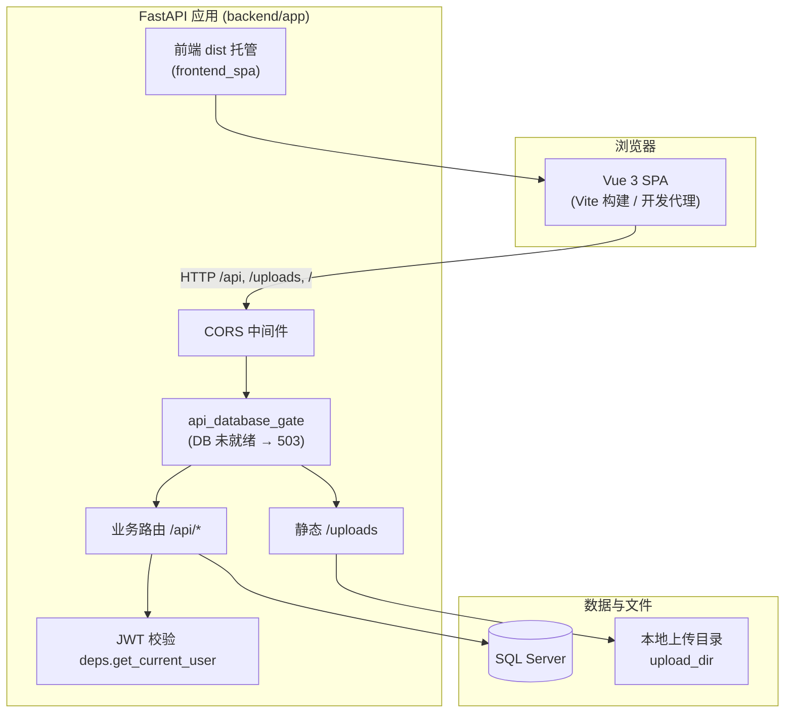
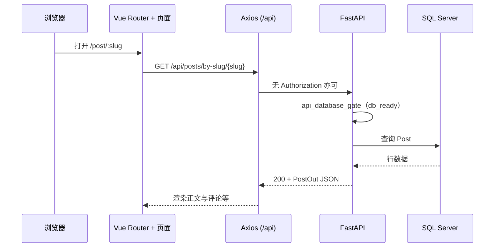
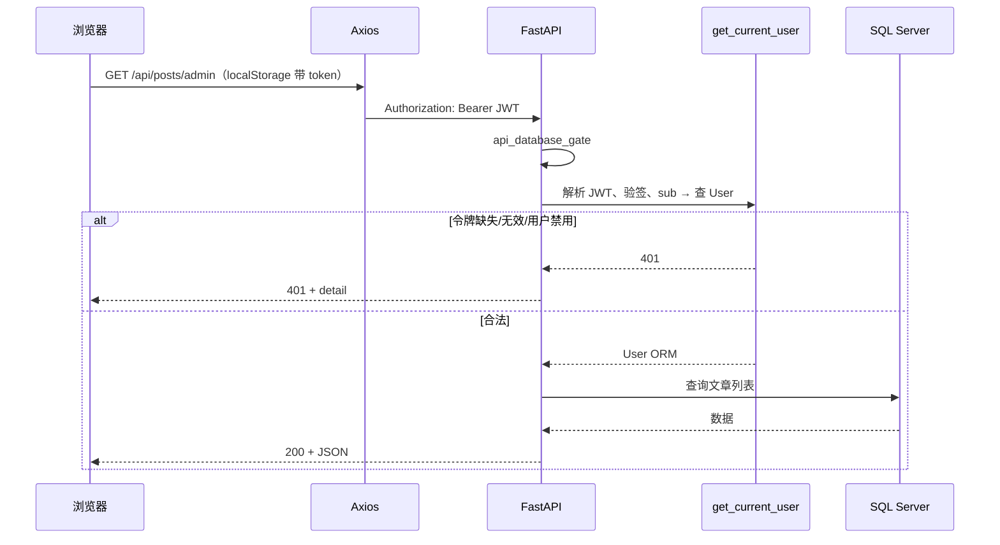
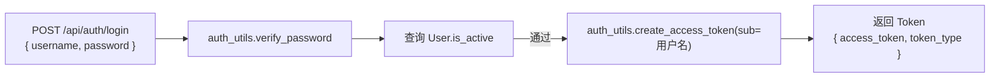

# PythonBlog 架构说明

本文档描述 **PythonBlog**（FastAPI + Vue 3 + SQL Server）的分层结构、典型请求时序与 JWT 鉴权流，便于部署与二次开发时对照。

---

## 1. 系统总览

**要点：**

- 开发时前端 `baseURL` 为 `/api`，由 Vite 代理到后端；生产可将构建产物由后端同域托管。
- 除 `/api/health` 外，若启动时数据库初始化失败，`/api/*` 会被中间件拦截并返回 **503**，避免 ORM 未就绪导致难以理解的 500。

---

## 2. 后端模块职责

| 路径 / 模块 | 职责 |
|------------|------|
| `app/main.py` | 创建 `FastAPI`、CORS、`register_api_db_gate`、挂载各 `routers`、静态 `/uploads`、健康检查 `/api/health`、条件挂载前端 `dist`。 |
| `app/lifespan.py` | 启动生命周期：建库/初始化、设置 `app.state.db_ready` / `db_error`。 |
| `app/config.py` | 自 `.env` 读取 `DATABASE_URL`、`SECRET_KEY`、CORS、上传目录等。 |
| `app/database.py` | SQLAlchemy Engine、Session、`get_db` 依赖。 |
| `app/deps.py` | `HTTPBearer` + `jwt.decode` + 查库：`get_current_user`（保护需登录接口）。 |
| `app/auth_utils.py` | 密码哈希/校验（bcrypt + SHA256 预处理）、`create_access_token`（JWT HS256）。 |
| `app/http_middleware.py` | `api_database_gate`：DB 未就绪时拒绝除 `/api/health` 外的 `/api` 请求。 |
| `app/frontend_spa.py` | 生产模式托管 SPA，History 路由回退 `index.html`。 |
| `app/routers/auth.py` | `/api/auth/login`、`/me`、`/logout`（登出以前端清 token 为准）。 |
| `app/routers/posts.py` | 文章公开列表/详情与后台 CRUD；后台接口依赖 `get_current_user`。 |
| `app/routers/categories.py` / `tags.py` | 分类、标签 API。 |
| `app/routers/comments.py` | 评论（公开与后台管理视路由而定）。 |
| `app/routers/users_admin.py` | 用户后台 CRUD（需登录）。 |
| `app/routers/upload.py` | 上传图片等到本地目录，静态通过 `/uploads` 访问。 |
| `app/services/*` | 领域逻辑封装（如文章序列化、评论等），供路由层调用。 |
| `app/models/*` | SQLAlchemy ORM 模型。 |
| `app/schemas/*` | Pydantic 请求/响应模型。 |

---

## 3. 前端模块职责（摘要）

| 路径 | 职责 |
|------|------|
| `src/api/http.js` | Axios 单例，`baseURL: /api`；请求拦截器从 `localStorage.blog_token` 注入 `Authorization: Bearer`。 |
| `src/api/auth.js` | 登录、登出占位、`/auth/me`。 |
| `src/api/*.js` | 各资源 REST 封装（posts、categories、tags、users、comments、upload）。 |
| `src/router/index.js` | 路由；`/admin/*` 子路由 `meta.requiresAuth`，无 token 跳转 `/admin/login`。 |
| `views/*` | 首页、文章页、后台登录与各管理页。 |

---

## 4. 典型请求时序

### 4.1 访问公开文章（无需登录）

### 4.2 后台管理 API（需 JWT）

### 4.3 数据库未就绪时的行为

- `GET /api/health`：始终可访问，返回 `status` 与 `database` 字段说明是否降级。
- 其他 `/api/*`：中间件直接 **503**，正文含「数据库未就绪」类提示，便于运维与前端统一展示。

---

## 5. 鉴权流

### 5.1 登录发牌

- 密码存储：`hash_password` 使用 **bcrypt(SHA256(明文))**，校验时兼容部分旧 bcrypt 明文方案（见 `auth_utils.py`）。
- JWT：`jose.jwt.encode`，载荷含 `sub`（用户名）、`exp`；算法与密钥来自 `app.config.settings`。

### 5.2 前端持有与附带令牌

1. 登录成功后，前端将 `access_token` 写入 **`localStorage`**（键名以项目实现为准，当前为 `blog_token`）。
2. **`http.js` 拦截器**为每个发往 `/api` 的请求自动添加 `Authorization: Bearer <token>`（若存在）。
3. **路由守卫**：访问 `meta.requiresAuth` 路由时若无 token，重定向到 `/admin/login?redirect=...`。

### 5.3 服务端校验（受保护路由）

1. 路由参数中声明 `current: User = Depends(get_current_user)`（或 `Annotated` 形式）。
2. `deps.get_current_user`：用 `HTTPBearer(auto_error=False)` 取头；无凭证或 JWT 校验失败 → **401**；`sub` 对应用户不存在或 `is_active=False` → **401**。
3. 本项目后台接口**不区分角色**：凡有效登录用户即可访问依赖 `get_current_user` 的管理接口（若需角色/权限，需在 `User` 模型与依赖中扩展）。

### 5.4 登出

- `POST /api/auth/logout` 为占位，**真正登出由前端删除 `localStorage` 中的 token** 并跳转登录页。

---

## 6. 与部署文档的关系

- 同目录下另有 IIS、同端口前后端等说明（如 `全栈说明.md`、`Windows11-IIS部署www-blogapi-8081.md`），部署时网络入口与静态路径以该文档为准；本文侧重 **应用内模块与鉴权逻辑**。

---

*文档版本与仓库代码一致时可直接放入 `docs/` 使用；若路由或存储键名变更，请同步更新本文中的路径与表项。*
