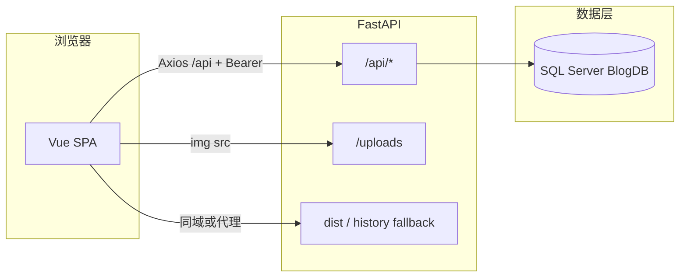

# PythonBlog 全栈说明

本文档是项目的**总览入口**：技术栈、端到端架构、**OpenAPI 与前端页面对照**，以及指向细分文档的索引。部署与排错可结合根目录 `访问说明.txt`、`database/` 脚本与 `backend/.env.example`。

---

## 1. 技术栈与仓库结构

| 层级 | 技术 |
|------|------|
| 前端 | Vue 3、Vue Router 4、Vite、Axios、marked |
| 后端 | FastAPI、Uvicorn、SQLAlchemy 2、pyodbc、SQL Server |
| 认证 | JWT（python-jose）、bcrypt |
| 构建产物 | `frontend/dist` 可由后端挂载为 SPA |

```
PythonBlog/
├── backend/app/          # FastAPI 应用
├── frontend/src/         # Vue 源码
├── database/             # SQL Server 初始化脚本
└── docs/                 # 说明文档（本目录）
```

---

## 2. 端到端架构（简图）



- **开发**：Vite 将 `/api`（及通常 `/uploads`）**代理**到 `127.0.0.1:8000`（见 `frontend/vite.config.js`）。
- **生产（同域）**：静态由 FastAPI 提供；API 与上传与前端同源，无 CORS 问题。
- **令牌**：前端 `localStorage.blog_token`；Axios 请求拦截器写 `Authorization: Bearer ...`。

---

## 3. OpenAPI 与前端页面对照表

以下路径均以 **`/api` 为前缀**（与 OpenAPI / Swagger 中一致）。`http.js` 的 `baseURL` 为 `/api`，故前端代码里写作 `client.get("/posts")` 等。

**鉴权列**：无 = 匿名可访问；JWT = 需有效 Bearer（后台管理页会带 token）。

| 方法 | OpenAPI 路径 | 鉴权 | 前端使用位置 | 说明 |
|------|----------------|------|----------------|------|
| GET | `/api/health` | 无 | （未封装） | 运维/排错；**数据库未就绪时仍可用** |
| POST | `/api/auth/login` | 无 | `AdminLogin.vue`、`auth.js` | 返回 `access_token` |
| GET | `/api/auth/me` | JWT | `auth.js` 已导出 **`authMe`** | **当前仓库页面未调用**，可扩展「当前用户」展示 |
| POST | `/api/auth/logout` | 无* | `AdminLayout.vue`、`App.vue`、`auth.js` | *带 token 亦可；实质以前端清 token 为准 |
| GET | `/api/posts` | 无 | `HomeView.vue`、`posts.js` | 查询参数含 `published_only`、`skip`、`limit` |
| GET | `/api/posts/by-slug/{slug}` | 无 | `PostView.vue` | 未发布文章对访客 404 |
| GET | `/api/posts/admin` | JWT | `AdminPostsPage.vue` | 列表 |
| GET | `/api/posts/admin/{id}` | JWT | `posts.js` **`adminGetPost`** | **已封装，当前页仅用列表数据编辑，未单独请求详情** |
| POST | `/api/posts` | JWT | `AdminPostsPage.vue` | 新建 |
| PATCH | `/api/posts/{post_id}` | JWT | `AdminPostsPage.vue` | 更新 |
| DELETE | `/api/posts/{post_id}` | JWT | `AdminPostsPage.vue` | 删除 |
| GET | `/api/categories/admin` | JWT | `AdminCategories.vue`、`AdminPostsPage.vue`（元数据） | |
| GET | `/api/categories/admin/{id}` | JWT | `categories.js` **`getCategoryAdmin`** | **已封装，页面未用**（列表足够） |
| POST | `/api/categories/admin` | JWT | `AdminCategories.vue` | |
| PATCH | `/api/categories/admin/{id}` | JWT | `AdminCategories.vue` | |
| DELETE | `/api/categories/admin/{id}` | JWT | `AdminCategories.vue` | |
| GET | `/api/tags/admin` | JWT | `AdminTags.vue`、`AdminPostsPage.vue` | |
| GET | `/api/tags/admin/{id}` | JWT | `tags.js` **`getTagAdmin`** | **已封装，页面未用** |
| POST | `/api/tags/admin` | JWT | `AdminTags.vue` | |
| PATCH | `/api/tags/admin/{id}` | JWT | `AdminTags.vue` | |
| DELETE | `/api/tags/admin/{id}` | JWT | `AdminTags.vue` | |
| GET | `/api/users/admin` | JWT | `AdminUsers.vue` | |
| GET | `/api/users/admin/{id}` | JWT | `users.js` **`getUserAdmin`** | **已封装，页面未用** |
| POST | `/api/users/admin` | JWT | `AdminUsers.vue` | |
| PATCH | `/api/users/admin/{id}` | JWT | `AdminUsers.vue` | |
| DELETE | `/api/users/admin/{id}` | JWT | `AdminUsers.vue` | |
| GET | `/api/comments/admin` | JWT | `AdminComments.vue` | |
| GET | `/api/comments/admin/{id}` | JWT | `comments.js` **`getCommentAdmin`** | **已封装，页面未用** |
| POST | `/api/comments/admin` | JWT | `AdminComments.vue` | |
| PATCH | `/api/comments/admin/{id}` | JWT | `AdminComments.vue` | |
| DELETE | `/api/comments/admin/{id}` | JWT | `AdminComments.vue` | |
| GET | `/api/comments/by-post/{post_id}` | 无 | `PostView.vue` | 公开评论列表 |
| POST | `/api/comments/by-post/{post_id}` | 无 | `PostView.vue` | 访客发表评论 |
| POST | `/api/upload/image` | JWT | `AdminPostsPage.vue`、`upload.js` | multipart，返回可写进正文的 URL |

**路由与页面（非 OpenAPI）**

| 路径 | 说明 |
|------|------|
| `/`、`/post/:slug` | 站点首页与文章页，使用站点顶栏 |
| `/admin/login` | 登录，隐藏站点顶栏 |
| `/admin/posts` 等 | `AdminLayout` + 子路由；**`meta.adminTitle`** 驱动顶栏标题 |

**Swagger UI**：后端启动后访问 **`/docs`** 可查看完整 OpenAPI 并与上表对照。

---

## 4. 跨切面行为（前后端共识）

| 主题 | 行为 |
|------|------|
| 数据库未就绪 | 中间件对除 `GET /api/health` 外的 `/api/*` 返回 **503** + `detail`；前端 axios 将 `detail` 并入 `Error.message` |
| JWT 失效/未登录 | 后台页加载数据时若 **401**，部分页面会清 token 并跳转登录（带 `redirect`） |
| 静态资源 | 用户上传：`/uploads/...`；构建资源：`/assets/...`（由 SPA 挂载策略决定） |

---

## 5. 细分文档索引

| 文档 | 内容侧重 |
|------|----------|
| [后端目录与文件说明.md](./后端目录与文件说明.md) | **`backend/` 树形目录**与每个文件/目录职责（本文档不重复罗列文件名） |
| [后端功能与代码设计说明.md](./后端功能与代码设计说明.md) | 模块目录、lifespan、ORM、分页补丁、各 router 职责、db_init/migrate |
| [前端功能与代码设计说明.md](./前端功能与代码设计说明.md) | 路由 meta、守卫、API 分层、`style.css` 中 `admin-*`、组件职责 |
| [后端部署说明.md](./后端部署说明.md) | **生产发布**：裸机 uvicorn、HTTPS/CORS、排错 |
| [后端-IIS部署说明.md](./后端-IIS部署说明.md) | **IIS**：HttpPlatformHandler、`web.config`、502.3、HTTPS、ARR 备选 |
| [IIS前后端部署.md](./IIS前后端部署.md) | **IIS 同一站点**：`backend` 为站点根、`frontend/dist` 与仓库结构、步骤与配置模板 |
| [Windows11-IIS部署www-blogapi-8081.md](./Windows11-IIS部署www-blogapi-8081.md) | **Windows 11 + IIS**：`www.blogapi.com:8081` 逐步部署、权限（icacls）、可访问 URL |
| [IIS同端口前后端原理.md](./IIS同端口前后端原理.md) | **原理**：IIS/HttpPlatformHandler 与 FastAPI 如何共用一个端口提供页面与 `/api` |

若只需 **接口清单**：以 **`/docs`（OpenAPI）** 为准，本文件 **§3** 补充「哪个 Vue 页面在用」。

---

## 6. 修订说明（文档格式偏好）

- **合并方式**：本文件为**全栈总览 + 对照表**；后端/前端**独立详解**仍保留，避免单文件过长。
- **对照表字段**：HTTP 方法、路径、鉴权、前端调用位置、实现差异常（未使用的封装函数会标注）。
- 后续若新增接口：请同步改 **`src/api/*.js`、对应 `.vue`，并更新本文件 §3**。
